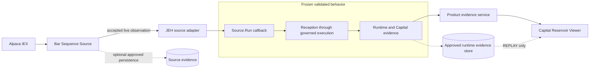
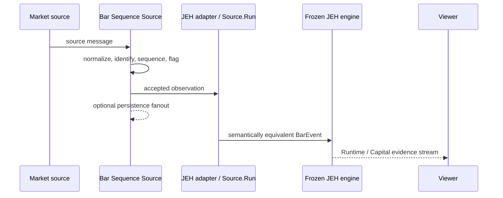

# JEH-HOHO Definitive Product System Design

| Metadata | Value |
|---|---|
| Date | 2026-09-17 |
| Version | 1.0 |
| Status | Authoritative design baseline; implementation authorized subject to validation gates |
| Product | JEH-HOHO |
| Component | Product system |
| Document Type | Definitive Product System Design |
| Authority | Chino Rao, Human Authority |

## 1. Purpose

Define the authoritative path from the validated DSE_JEH lab lineage to an independent, real-time JEH-HOHO product without changing JEH mathematics, governed behavior, Capital arithmetic, evidence semantics, accepted Bar semantics, or established failure behavior. The design makes Child's Play operation a product property and carries code-derived behavior forward without manufacturing policy decisions from documentation gaps.

## 2. Executive Overview

JEH-HOHO will package four narrowly owned runtime components: a graduated Bar Sequence source, the frozen JEH processing engine behind its existing `Source.Run` boundary, a local product lifecycle controller, and the Capital Reservoir Viewer. One product-owned V1 protobuf source and its coherently generated clients will be package assets. The product will not require Fin_FeedSat_1, the `tramuthus` tree, Go, npm, or development commands at runtime.

The validated downstream JEH pipeline is not redesigned. Product work occurs above its source callback, in online composition needed to instantiate existing evidence writers and the existing Capital Reservoir, around external product contracts, and in lifecycle and packaging. MongoDB persists the existing trace and Capital evidence needed by established Capital production and Viewer REPLAY; it is not the live transport.

Code, tests, and runtime evidence resolve the former HD-01 through HD-09 gates. The Bar Sequence generator subscribes to and separately accepts Alpaca `b` and `u` arrivals without consolidation; validated offline mapping treats each persisted accepted observation as final at the JEH boundary. Reconnect recreates the source session with no gap fill while preserving engine-owned collection and sequence state. Existing delivery and evidence writes are bounded-channel or synchronous/blocking operations whose failures propagate. Current online DSE_JEH composition omits the trace/Capital writer assembly used by validated offline composition, so product assembly must inject those same interfaces without changing their ordering, validation, persistence, arithmetic, or failure behavior. No new semantic human decision remains from HD-01 through HD-09.

## 3. Scope

- Independent real-time market acquisition and accepted Bar Sequence production.
- Adaptation into the validated DSE_JEH source boundary.
- Existing JEH processing and governed execution behavior.
- Existing Runtime and Capital evidence made available in real time.
- LIVE-first and established REPLAY Viewer behavior.
- Product-owned protobuf boundary design.
- Product-local start, status, stop, configuration, packaging, observability, and support.
- Validation and implementation authorization gates.

## 4. Out of Scope / Explicit Non-Goals

- Mathematical, semantic, threshold, admission, analytical, phase, eligibility, decision, execution, allocation, risk, Capital, or governed-transition changes.
- New price or volume abstractions, including `P[n]`.
- Fin_FeedSat_1 integration or deployment.
- Power Station / Master Pipeline Control Board work.
- Generic orchestration framework design.
- Broker execution or live capital deployment.
- MongoDB redesign or migration.
- Changes to any reference repository.
- Actual Go, Viewer, script, packaging, configuration, or protobuf implementation in this pass.

## 5. Dependencies / References

### Human Authority

- Design authorization dated 2026-09-17.
- Corrected reference authority path: `C:\Users\chino\tramuthus\DSE_JEH_Lab`.
- Explicit decisions that JEH-HOHO is independent and owns its product protobuf contract.

### Reference Authorities Inspected

- `C:\Users\chino\tramuthus\DSE_JEH_Lab`
- `C:\Users\chino\tramuthus\Bar_Sequence_Lab`
- `C:\Users\chino\tramuthus\Capital_Reservoir_Viewer`
- `C:\Users\chino\tramuthus\docs\JEH_HOHO_CHILDS_PLAY_REAL_TIME_PRODUCTIZATION_DESIGN_AND_IMPLEMENTATION_READINESS_2026-09-17.md`

The previous investigation's verified technical findings were checked against source. Its former repository-governance prohibition and any recommendation not to create a product proto are superseded and are not product authority.

### Principal Source Evidence

| Finding | Evidence |
|---|---|
| Internal source boundary | `DSE_JEH_Lab\internal\app\source.go`: `Source.Run(context.Context, func(*dsejeh.v1.BarEvent) error) error` |
| Downstream ownership | `internal\app\pipeline.go` and `internal\services\services.go` |
| Offline mapping/finality | `internal\input\offline\producer.go` |
| Existing online Fin mapping | `internal\input\online\consumer.go` |
| Online/offline composition | `internal\app\application.go` |
| Trace identity and Capital assembly | `internal\execution\trace.go`, `capital_reservoir.go`, and pipeline trace handling |
| DSE contract | `api\proto\dse_jeh\v1\DSE_JEH_TransSat_1.proto` |
| Bar sequence authority | `Bar_Sequence_Lab\generator\internal\sequence\authority.go` and tests |
| Viewer live transport | `Capital_Reservoir_Viewer\src\lib\grpc-live.ts` and related SSE/UI code |
| Historical collection lineage | DSE_JEH exports containing collection run `20260911T161623Z-1` |

## 6. Assumptions

- The existing validated DSE_JEH regression suite remains the acceptance authority for frozen behavior.
- Alpaca IEX remains the intended initial external source, subject to credential and entitlement approval.
- Product packaging targets Windows first; component boundaries remain portable.
- Historical persisted observations are replay evidence, not authority for a new live finalization rule.
- Existing source code, tests, fixtures, composition, defaults, and runtime evidence define the productization baseline even when the behavior exposes a limitation.
- Capital-producing operation and established Viewer REPLAY use the existing durable trace/Capital writer behavior.

## 7. Invariants / Frozen Decisions

1. JEH-HOHO is a new independent repository and runtime product.
2. `DSE_JEH_Lab` is the corrected reference name.
3. The accepted DSE_JEH source callback is the internal frozen integration boundary unless regression evidence disproves equivalence.
4. Everything downstream of that boundary is frozen except explicit product composition and transport adapters that do not alter semantic values.
5. The Bar Sequence generator is the acquisition and sequencing implementation authority.
6. MongoDB is not the live message transport without later human authorization.
7. JEH-HOHO owns its minimum coherent product protobuf contract.
8. JEH-HOHO V1 uses one product-owned protobuf source file, one package version, one Buf module, one `buf.gen.yaml`, and one deterministic generation operation.
9. The Viewer remains a specialist Capital view, not a control board.
10. Unknown processes are never killed merely because a port is occupied.
11. No runtime artifact may import, locate, configure, or invoke Fin_FeedSat_1 or `tramuthus`.

## 8. Product Purpose and Boundary

JEH-HOHO turns independently acquired accepted market Bars into the existing JEH Runtime and Capital evidence and presents that evidence to a normal operator. It owns acquisition, product identity, delivery, composition, evidence publication, lifecycle, Viewer packaging, and supportability. It does not own a reinterpretation of JEH domain semantics.



The market source and evidence stores are external trust boundaries. All runtime binaries, contracts, generated clients, scripts, assets, and configuration between them are JEH-HOHO package assets.

## 9. Child's Play Product Principle

The normal operator workflow is:

```text
START -> PREFLIGHT -> CONNECTING -> READY -> VIEW LIVE -> OPTIONAL REPLAY -> STOP
```

The product generates required internal run identities, starts components in dependency order, waits for explicit readiness, launches the packaged Viewer and browser, reports degraded states in product language, and stops only owned processes in reverse order. Internal identity remains in evidence and diagnostics but is not operator ceremony.

The operator does not use Go, npm, protobuf, gRPC addresses, Mongo queries, collection IDs, environment syntax, source paths, internal stage names, or PID management.

## 10. Reference Lineage and Authority

### DSE_JEH_Lab

Authority for validated downstream processing, the internal `BarEvent` boundary, Runtime Evidence semantics, Capital Reservoir arithmetic, governed transitions, and historical regression evidence. Productization copies a reviewed snapshot into JEH-HOHO with provenance; it does not link back to the reference tree.

### Bar_Sequence_Lab

Authority for Alpaca connection lifecycle, subscriptions, accepted-observation construction, per-symbol sequencing, collection identity, duplicate preservation/detection, source-time regression detection, source provenance, and source persistence behavior. These capabilities graduate rather than being reimplemented independently.

### Capital_Reservoir_Viewer

Authority for the established specialist presentation and existing LIVE/REPLAY concepts. It is a consumer of evidence, not authority to redefine Capital values or event semantics.

### Previous Investigation

Technical statements are evidence only where reconfirmed. Superseded governance is excluded.

## 11. Frozen JEH Behavior

The following are immutable during productization: inputs and outputs; formulas and transformations; thresholds; Bar and volume semantics; `V(t)` and derivatives; admission; analytical state; phase; production eligibility; decisions; execution; allocation; risk; Capital arithmetic and events; Runtime Evidence; and governed transitions.

Any required change in those areas stops the affected slice. The conflict must identify the existing behavior, proposed necessity, evidence, compatibility impact, and human decision required. An adapter may map transport representation but must preserve every semantic field consumed by JEH.

## 12. Historical Validated Path

Historical evidence confirms an offline path:

```text
Alpaca-derived Bar Sequence -> MongoDB bar_sequence
-> DSE_JEH OFFLINE replay -> validated JEH processing
-> Runtime / Capital evidence
```

The known collection lineage includes `OfflineCollectionRunID=20260911T161623Z-1`. Exported evidence shows `ALPACA_IEX`, per-symbol sequence, collection identity, and `is_final=true`. Source shows offline mapping hardcodes finality and ordered replay policy.

`CODE SUPPORTS`: DSE_JEH also contains an ONLINE adapter to Fin_FeedSat_1.

`HISTORICAL EVIDENCE SHOWS`: the identified validated lineage used offline Mongo replay. No inspected evidence proves Fin_FeedSat_1 generated that lineage. The verified machine lineage is collection `20260911T161623Z-1`. The friendly label `Run C` was not independently located and is therefore not asserted or used as an implementation gate.

## 13. Target Real-Time Path

The live path delivers each accepted Bar directly from the graduated source to the JEH adapter. Persistence, when enabled, receives the same immutable accepted-observation value through a separate sink. Persistence failure must not silently transform Mongo into transport or conceal loss.



## 14. Product Independence Requirements

The clean-package test makes Fin_FeedSat_1 absent and the complete `tramuthus` tree unavailable. From a new path, JEH-HOHO must start, connect to the approved source, produce accepted Bar Sequence observations, execute frozen JEH behavior, emit Runtime/Capital evidence, operate LIVE and approved REPLAY, produce diagnostics, and stop cleanly.

Forbidden runtime dependencies include imports, endpoints, environment variables, generated code, dynamic proto paths, startup assumptions, package assets, and documentation steps that refer to Fin_FeedSat_1 or `tramuthus`.

## 15. Component Model

| Component | Owner | Responsibility | Must not own |
|---|---|---|---|
| Lifecycle Controller | JEH-HOHO product | Preflight, identity, start/status/stop, readiness, browser launch, support bundle, process ownership | Generic orchestration or model decisions |
| Bar Sequence Source | Source component | Alpaca lifecycle, normalization, acceptance, source identity, per-symbol sequence, live delivery, approved persistence | JEH math or source-boundary reinterpretation |
| JEH Engine | JEH component | Frozen reception through governed execution | Acquisition, UI, lifecycle orchestration |
| Evidence Gateway | Evidence component | Product-owned status and evidence contract; faithful mapping from internal events | Recalculation or semantic filtering that changes evidence |
| Capital Reservoir Viewer | Viewer component | LIVE-first specialist view and established REPLAY | Evidence authority or Master Controller behavior |

Deployment may combine JEH Engine and Evidence Gateway in one process initially. The ownership boundary remains explicit even when process boundaries are consolidated.

## 16. Bar Sequence Source Ownership and Graduation

| Classification | Capability | Product treatment |
|---|---|---|
| REUSE AS-IS | Per-symbol accepted-arrival sequence authority and locking behavior | Copy with tests and provenance |
| REUSE AS-IS | Collection run stamping, duplicate-arrival and source-time-regression flags | Copy with tests and provenance |
| COPY INTO PRODUCT | Alpaca WebSocket lifecycle, subscriptions, normalization, accepted observation construction | Preserve behavior; remove lab path assumptions |
| COPY INTO PRODUCT | Source provenance and payload identity logic | Preserve values and add compatibility fixtures |
| ADAPT IN PRODUCT | Reconnect reporting and lifecycle cancellation | Add product states without changing accepted observations |
| ADAPT IN PRODUCT | Fanout to live delivery and existing persistence | Preserve configured bounded channels, blocking delivery, synchronous writes, and failure propagation |
| ADAPT IN PRODUCT | Configuration, credentials, health, logs, packaging | Product-owned and Child's Play |
| DO NOT CARRY FORWARD | Lab-only partition/run ceremony and source-tree-relative assets | Retain only in reference validation fixtures when required |
| DO NOT CARRY FORWARD | Fin_FeedSat_1 adapter/dependency | Excluded from source and package |
| CODE-DERIVED | `b` and `u` handling, reconnect/no-gap-fill, blocking and persistence behavior | Preserve and validate exactly; expose limitations through status |

The product subscribes to both Alpaca `bars` and `updatedBars`. Both `b` and `u` messages use the same decoder and acceptance path, remain separate immutable observations, retain their message type and raw-payload hash, and receive per-symbol sequence identity. No consolidation or update-in-place behavior exists or is added. Duplicate arrivals continue to receive sequence identity and a duplicate flag; they are not silently dropped.

## 17. Live Delivery Design

The Bar Sequence Source publishes a product-owned `AcceptedBarObservation` stream to exactly one JEH consumer in version 1. It assigns collection and per-symbol sequence identity before delivery. The JEH adapter maps the received immutable value to internal `dsejeh.v1.BarEvent` and invokes the callback serially in accepted order. Both accepted Alpaca message types use the established offline-boundary final provenance; the adapter does not infer, consolidate, or replace source observations.

The stream defines ordering by `(collection_id, symbol, entity_sequence)`, cancellation, and terminal status. Existing reconnect creates a fresh WebSocket, reauthenticates, and recreates `bars` and `updatedBars` subscriptions after capped exponential backoff. The engine-owned sequence authority and collection identity survive reconnect. There is no resume token, backfill, or source-gap proof. Product status reports `RECONNECTING` and `CONTINUITY UNKNOWN` after a disconnected interval; counters are not reset and no continuity guarantee is invented.

Live and persisted/replayed equivalence compares semantic JEH inputs: symbol/entity, interval and times, OHLC, volume, event count, source identity, collection identity, entity sequence, established final provenance, message type, and payload identity where carried. Connection/session details, receive times, RPC framing, and replay order annotation are compared separately as transport provenance.

## 18. DES_JEH Integration Boundary

Verified internal boundary:

```go
Source.Run(context.Context, func(*dsejeh.v1.BarEvent) error) error
```

The new product source adapter implements this interface. It populates all existing required Bar fields and `SourceProvenance`, including source mode, source ID, source observation ID, collection identity, entity sequence and scope, source timestamp, established accepted-observation final provenance, and payload identity where represented. Offline and live transport annotations may differ; semantic values may not.

Reception validates identity and provenance before the existing pipeline proceeds through admission, analytical state, phase, eligibility, and dynamic execution. No internal DSE_JEH stage service becomes a public API for convenience.

## 19. Capital Assembly

Source inspection verified an assembly asymmetry. Default offline production composition opens the trace writer and Capital Reservoir writer and constructs the existing reservoir. Default online composition does not; a nil reservoir means no `CapitalReservoirEvent` stream. Execution-derived Capital events also require the valid nonzero `stage_emit_value_id` returned by the trace writer.

The minimum product assembly is:

1. Open the existing Mongo trace writer through package-managed configuration.
2. Open the existing Mongo Capital Reservoir writer through package-managed configuration.
3. Construct the existing `CapitalReservoir` with product-generated pipeline/collection/run identity.
4. Inject those existing interfaces into online composition.
5. Preserve existing trace-before-Capital ordering so the stage identity exists.
6. Publish the resulting unchanged events through the product evidence adapter.
7. Preserve synchronous single-attempt writes and existing error propagation. Trace failure stops processing before Capital; Capital failure returns before reservoir state mutation. Never use fake/discard writers to satisfy constructors.

This changes composition, not Capital arithmetic, validation, event semantics, or governed execution.

The implemented current-runtime delivery path is:

```text
Alpaca real-time Bars
  -> Bar Sequence Source
  -> DSE_JEH
  -> Capital Reservoir Event
  -> synchronous Mongo persistence
  -> persistence SUCCESS
  -> existing in-process Runtime Evidence bus
  -> JEH-HOHO product gRPC stream
  -> Viewer server SSE bridge
  -> Viewer LIVE
```

The gRPC stream carries the same committed Capital event returned by the existing persistence boundary. It does not carry a replacement identity and does not reread Mongo. A persistence error returns before bus publication, so an uncommitted event cannot reach LIVE.

## 20. Runtime Evidence

Internal Runtime Evidence remains the authoritative record of existing stage outcomes. The product gateway exposes only evidence needed by the Viewer, status, continuity diagnosis, and future external integration. It must not expose the complete internal service graph or invite callers to drive individual pipeline stages.

Evidence identity connects product version, generated product/runtime identity, source-generated collection identity, per-symbol sequence, derived pipeline run, trace stage identity, and Capital event identity. The controller supplies the existing valid run-type configuration and propagates the source collection identity without asking the operator to type either value. Existing constructors and validators remain the authority. Logs supplement evidence; they do not replace it.

## 21. Capital Reservoir Viewer

The graduated Viewer preserves the established specialist presentation and KLine Charts behavior. Its Next.js server bridges the product-owned generated gRPC client to browser SSE delivery; it has no runtime proto loader or reference-tree dependency. Its standalone package includes traced server files and copied `.next/static` assets.

Productization does:

- preserve established Capital values, terminology, and presentation unless a separate UI defect is approved;
- default to LIVE and connect automatically;
- show explicit `starting`, `connecting`, `waiting for evidence`, `live`, `degraded`, `continuity fault`, and `unavailable` states;
- reconnect automatically with bounded backoff and visible continuity status;
- close and replace failed server-side streams cleanly;
- use product-owned generated clients or package-relative descriptors;
- perform no Mongo query merely because LIVE starts;
- enter REPLAY only by operator action and retain established replay semantics;
- build deterministically as a standalone production artifact with all static assets;
- launch the browser only after Viewer readiness;
- display concise support information and correlation identity without developer configuration.

LIVE subscribes only to the currently running DSE_JEH product stream and never queries or selects a persisted run. A gRPC fault is displayed and closes the SSE response so native `EventSource` reconnects automatically. REPLAY is entered only by operator action and reads Mongo events for the deliberately selected `pipeline_run_id`, ordered by `event_sequence`.

## 22. Persistence and Replay

No Mongo migration is designed here. Existing persistence is classified as follows:

| Artifact | Classification | Product requirement |
|---|---|---|
| Bar Sequence JSONL/Mongo observations | SOURCE EVIDENCE; historical LAB / VALIDATION | Preserve graduated source evidence behavior for audit/regression; not required by Viewer REPLAY or live transport |
| Ordered offline collection `20260911T161623Z-1` | LAB / VALIDATION and replay fixture | Retain as regression lineage, not live transport |
| Trace records and `stage_emit_value_id` | PRODUCT RUNTIME EVIDENCE | Required by existing execution-derived Capital behavior |
| Capital Reservoir events | PRODUCT RUNTIME EVIDENCE and PRODUCT REPLAY REQUIREMENT | Required for Capital LIVE and existing Viewer REPLAY |
| Phase evidence exports/writers | LAB / VALIDATION unless enabled by existing package configuration | Preserve existing optional output behavior; not a Viewer dependency |

Persistence is the commit boundary before live delivery, not the live transport. Existing Bar source channels apply configured bounds and blocking. Existing trace and Capital writes are synchronous and single-attempt. Writer errors propagate from the affected processing path; Capital state is committed only after successful event persistence and only then published to the product stream. Product status exposes these failures without adding a queue, retry, drop, or degradation policy.

REPLAY remains a separate path:

```text
Mongo persisted Capital events
  -> deliberately selected historical pipeline run
  -> event_sequence ordering
  -> Viewer REPLAY
```

## 23. Product-Owned Proto Design

By human architectural decision, JEH-HOHO V1 owns one protobuf source file:

```text
api/proto/jeh_hoho/v1/JEH_HOHO.proto
```

The file declares `package jeh_hoho.v1;` and contains three logically separated services: `AcceptedBarSourceService`, `ProductEvidenceService`, and `ProductOperationsService`. This is one coherent product contract, not one undifferentiated service and not a renamed copy of `DSE_JEH_TransSat_1.proto`. The actual file remains unauthorized until contract review and implementation authorization.

Compliance statement: package `jeh_hoho.v1;`; one product proto module; one buf.yaml; one buf.gen.yaml; one deterministic generation operation.

### Single-File Rationale and Governance

- **Shared definitions:** `ProductIdentity`, `SourceIdentity`, `ContinuityStatus`, `ComponentStatus`, lifecycle/status enums, timestamps, and evidence identity have one authoritative definition without duplication or cross-file ownership.
- **Synchronized change authority:** a compatible V1 change has one obvious source of truth and one dependency surface to review.
- **Coherent product versioning:** source, evidence, and operations are services within one product contract version; they are not independently versioned contracts.
- **Buf simplification:** one module, generation configuration, and operation avoid per-service generation scopes, import relationships, and output ownership.
- **Current contract size:** there is no demonstrated contract-size, release, governance, or tooling reason for physical fragmentation.
- **No arbitrary threshold:** physical splitting has no numeric line-count threshold.
- **Future human approval to split:** a material technical reason and explicit human architectural decision are required before physical splitting.
- **Child's Play maintainer simplicity:** maintainers edit one product contract, run one generation operation, and validate one coherent generated surface; operators encounter none of this tooling.
- Strong internal sections and complete documentation provide navigation; physical splitting is not a substitute for documentation.

### Required Logical Organization

`JEH_HOHO.proto` is organized in this order:

1. Complete file/contract header required by the artifact standard.
2. `syntax = "proto3";` and `package jeh_hoho.v1;`.
3. Common product enums: lifecycle/status, continuity, evidence type, and other genuinely shared enums.
4. Common product identity/shared messages: `ProductIdentity`, `SourceIdentity`, `ComponentStatus`, `ContinuityStatus`, and other genuinely shared types.
5. Accepted Bar source contract: `AcceptedBarSourceService`, `StreamAcceptedBarsRequest`, `AcceptedBarObservation`, `SourceStreamStatus`, and associated source messages.
6. Product evidence contract: `ProductEvidenceService`, `SubscribeEvidenceRequest`, `ProductEvidenceEnvelope`, `CapitalReservoirEvidence`, and associated evidence messages.
7. Product operations/status contract: `ProductOperationsService`, `GetStatusRequest`, `ProductStatus`, and associated status messages.

The exact messages and fields encode the code-derived baselines recorded in `docs/investigation/JEH_HOHO_CODE_DERIVED_PRODUCTIZATION_BEHAVIOR_2026-09-17.md`. The contract exposes established accepted-observation identity, no-gap-fill continuity truth, existing failure/status behavior, and automated existing identities without creating new source or JEH semantics.

### Buf Generation Boundary

JEH-HOHO V1 has one product proto module, one authoritative `buf.yaml`, one authoritative `buf.gen.yaml`, and one documented deterministic `buf generate` operation. That operation reads `JEH_HOHO.proto` and produces all required Go and Viewer product contract artifacts from the same source revision and generation configuration. Separate Buf modules, generation configurations, or generation commands per service are prohibited unless a future demonstrated requirement receives human architectural approval.

This single edit/generate/validate path supports Child's Play engineering for maintainers while remaining completely invisible to the normal operator.

### Existing Contract Classification

| Class | Existing concepts | Graduation rule |
|---|---|---|
| A. Validated internal domain | `BarEvent`, `SourceProvenance`, admission, analytical, phase, eligibility, execution types | Remain internal; adapter maps without semantic change |
| B. Internal-only implementation | Stage service requests/responses and internal orchestration services | Do not graduate |
| C. Runtime Evidence | Runtime envelope and selected stage/result identity | Expose only minimum status/evidence subset |
| D. Capital evidence | `CapitalReservoirEvent` | Graduate a wire-compatible semantic representation after field audit |
| E. Viewer-required | Capital stream identity, timestamps, values, replay/status data | Include only fields actually required for established LIVE/REPLAY |
| F. Genuine product boundary | Accepted Bar stream, product status, evidence subscription | Product-owned versioned services |
| G. Lab-only | Run ceremony, validation/export controls, fixture-only messages | Do not graduate |
| H. Must not graduate | Internal stage-driving APIs and Fin contracts | Exclude |

### Conceptual Services and Messages

`AcceptedBarSourceService.StreamAcceptedBars(StreamAcceptedBarsRequest) returns (stream AcceptedBarObservation)` is called only by the JEH source adapter. The server owns source identity and accepted-arrival ordering. Cancellation ends the subscription, not the market source process. Reconnect has no resume/backfill guarantee, both `b` and `u` arrivals remain distinct, and the contract reports continuity as unknown after disconnection rather than inventing recovery.

`ProductEvidenceService.SubscribeEvidence(SubscribeEvidenceRequest) returns (stream ProductEvidenceEnvelope)` serves the Viewer and approved diagnostics. Version 1 carries the minimum established Capital event and runtime/continuity status variants. It guarantees order within a documented product run and reports when continuity cannot be proven; it does not recompute evidence.

`ProductOperationsService.GetStatus(GetStatusRequest) returns (ProductStatus)` serves the lifecycle controller and Viewer. It reports product/component version, run identity, lifecycle state, source connection, JEH readiness, evidence readiness, Viewer readiness, continuity state, and sanitized fault summaries. It does not start, stop, or mutate JEH behavior.

Conceptual supporting messages are `ProductIdentity`, `SourceIdentity`, `AcceptedBarObservation`, `SourceStreamStatus`, `ProductEvidenceEnvelope`, `CapitalReservoirEvidence`, `ContinuityStatus`, `ComponentStatus`, and `ProductStatus`. Every identity scope, unit, optional/default meaning, temporal meaning, ordering, cancellation, error, retry, and security rule must be documented under the artifact standard before implementation.

### Compatibility Strategy

- The product contract is versioned coherently as `jeh_hoho.v1`; its services are not independently versioned.
- A genuinely incompatible product contract moves deliberately to a new major namespace such as `jeh_hoho.v2` only after human architectural approval.
- Frozen internal-to-product mappings use golden fixtures from validated evidence.
- Unknown enum values are preserved or surfaced safely, never coerced into an existing meaning.
- Compatible V1 evolution is additive where appropriate, never reuses field numbers, reserves removed field numbers and names, never changes an existing field's semantic meaning, and documents compatibility changes.
- Generated Go and Viewer clients are pinned, reproducible package assets from the same deterministic Buf generation operation.
- The Viewer depends only on product-owned generated output from `JEH_HOHO.proto`.
- A future Master Controller may read product status/evidence, but no control RPC or controller behavior is designed now.

## 24. Lifecycle: Start, Status, Stop

The local controller is narrow and package-owned.

### Start

1. Verify package manifest/integrity and supported platform.
2. Load validated configuration and credentials without printing secrets.
3. Check writable paths and approved evidence dependencies.
4. Reserve/check configured ports; stop if occupied by an unknown process.
5. Generate product, source collection, and pipeline run identities under approved policy.
6. Start source; wait for process and source readiness.
7. Start JEH/evidence process; wait for JEH and evidence readiness.
8. Start Viewer; wait for HTTP readiness.
9. Record owned PIDs plus executable identity and launch correlation.
10. Open the browser to LIVE.

On partial failure, stop only components started and proven owned by this attempt, preserve diagnostics, and return a product-language error.

### Status

Report `STOPPED`, `STARTING`, `CONNECTING`, `READY`, `DEGRADED`, `FAILED`, or `STOPPING`, plus component state, market connection, last accepted Bar, continuity, last Capital evidence, and support correlation. Status must distinguish process liveness from readiness.

### Stop

Request graceful shutdown in reverse dependency order: Viewer, JEH/evidence, then source. Propagate cancellation, drain according to approved bounds, close writers and sockets, and wait for owned processes. Escalation may terminate only a process whose PID and executable/start identity match the ownership record. Stale records are reported and quarantined; unrelated processes are untouched.

## 25. Configuration and Credentials

Normal operation uses one package-relative product configuration surface and an OS-appropriate secret store or protected credential file. First-use tooling validates Alpaca credentials and permissions without exposing them. Configuration separates operator settings from generated identities and advanced support settings.

Required design categories are market endpoint/feed, symbol set, interval, Viewer port, existing evidence storage endpoints, log/support paths, and retention. Configuration exposes only choices permitted by established behavior. Both accepted Alpaca `b` and `u` arrivals remain separate observations with no consolidation or update-in-place and use the existing accepted/final mapping into the JEH boundary. Reconnect reauthenticates and resubscribes without gap fill; disconnected intervals report continuity `UNKNOWN` when continuity cannot be proven. The product preserves existing source evidence persistence, required synchronous trace/Capital persistence, Capital-event Viewer REPLAY, bounded/blocking delivery, and error propagation. These are code-derived baselines, not configurable policy alternatives.

## 26. Health, Readiness, and Degraded States

| Signal | Ready when | Degraded/failure examples |
|---|---|---|
| Source process | Configuration valid and service accepting JEH consumer | Process unavailable |
| Market source | Authenticated and subscribed | Reconnecting, entitlement failure |
| Accepted stream | Identity assigned and stream available | Continuity unproven, sink blocked |
| JEH | Source callback active and frozen pipeline initialized | Source unavailable, evidence dependency failed |
| Evidence | Existing writers/reservoir and publication path ready | Required persistence unavailable |
| Viewer | Production server healthy and subscription attempt active | Gateway unreachable, continuity fault |
| Product | All mandatory readiness predicates true | Any mandatory predicate false |

`READY` does not require a recent or first market Bar. Existing DSE readiness occurs after the listener and source adapter are ready, before source receipt. Status distinguishes connection/subscription/reconnect state and reports last activity when available; V1 introduces no freshness timeout or market-calendar semantic.

## 27. Error and Failure Model

- Configuration, package integrity, credential, and occupied-port failures block startup before processes are launched.
- Authentication/entitlement failures are terminal until configuration changes.
- Transient network loss enters reconnecting state with the existing capped backoff and no gap fill.
- Continuity after a disconnected interval is reported `UNKNOWN`; this is an observation of existing limits, not a new recovery policy.
- Invalid or conflicting source observations retain established flags/evidence and follow approved acceptance policy.
- Trace or Capital writer failure propagates synchronously from the affected processing call and is never hidden.
- Viewer loss does not change JEH semantics; it is visibly unavailable and reconnects.
- Shutdown timeout preserves diagnostics and escalates only against proven-owned processes.
- All user-facing faults include a stable code, plain-language summary, timestamp, run identity, and support path without secrets.

## 28. Packaging

The deterministic release package contains versioned source, JEH/evidence, controller, and Viewer executables/assets; generated Go and Viewer contract artifacts derived from the same `JEH_HOHO.proto` source and Buf generation run; configuration template/schema; manifest/checksums; lifecycle entry points; operator guide; dependency notices; and support tooling.

The Viewer uses a production standalone build and package-relative static/generated assets. The Go components are built reproducibly with recorded toolchain and module locks. Package provenance records the contract source revision, `buf.yaml`, `buf.gen.yaml`, Buf/plugin versions, and deterministic generation operation. Installation and first use do not require Go, Node.js/npm, Git, Buf, protobuf knowledge, source repositories, or developer shells beyond the signed/product entry points selected later.

## 29. Proposed Repository Structure

No directories below are authorized for creation until the relevant implementation slice is approved.

```text
JEH_HOHO/
  api/
    proto/
      jeh_hoho/
        v1/
          JEH_HOHO.proto
  buf.yaml
  buf.gen.yaml
  cmd/
    source/
    jeh/
    controller/
  internal/
    source/
    jeh/
    evidence/
    lifecycle/
  viewer/
  config/
  packaging/
  tests/
    compatibility/
    integration/
    acceptance/
  docs/
    design/
    implementation/
    investigation/
    operator/
```

| Path | Purpose / owner / why | Must not contain |
|---|---|---|
| `api/proto/jeh_hoho/v1/JEH_HOHO.proto` | Contract owner; single authoritative V1 product protobuf source containing the three logical services and shared definitions | Complete DSE proto copy, generated output, or unresolved semantic inventions |
| `buf.yaml` | Single JEH-HOHO V1 Buf module definition | Per-service modules or unrelated contract modules |
| `buf.gen.yaml` | Single deterministic generation configuration for all Go and Viewer contract outputs | Per-service generation configuration or hand-maintained generated code |
| `cmd` | Thin executable composition roots owned by each component | Domain math or reusable logic |
| `internal/source` | Graduated acquisition/sequencing and transport | JEH processing |
| `internal/jeh` | Reviewed frozen JEH snapshot and source adapter | UI or orchestration framework |
| `internal/evidence` | Existing writer assembly and faithful product mapping | New Capital arithmetic |
| `internal/lifecycle` | Product-local preflight/readiness/process ownership | Generic process manager |
| `viewer` | Packaged specialist LIVE/REPLAY UI | Runtime source-tree proto loading or control board |
| `config` | Templates/schema and non-secret defaults | Credentials or machine-specific live values |
| `packaging` | Deterministic build/package/service assets | Source-of-truth business logic |
| `tests` | Compatibility, integration, clean-package and operator acceptance | Production runtime dependencies |
| `docs/operator` | Child's Play guide | Architecture required for normal use |

## 30. Security and Trust Boundaries

- Alpaca and persistence endpoints are external authenticated dependencies.
- Credentials are least-privilege, protected at rest, redacted, and never bundled.
- Product gRPC/HTTP listeners default to loopback for a single-machine package; remote exposure requires a separate authentication/TLS decision.
- Source observations are untrusted until normalized, validated, identified, and sequenced.
- Product contracts validate sizes, enums, identity, timestamp ranges, and malformed input.
- Viewer output encodes untrusted text and exposes no secret configuration.
- Package manifest and executable identity protect lifecycle ownership decisions.
- Support bundles use an allowlist and redact secrets, tokens, URIs containing credentials, and sensitive environment data.

## 31. Logging and Support

Structured logs include timestamp, severity, component/version, product run identity, source collection identity where applicable, event/correlation identity, stable fault code, and state transition. They exclude credentials and unnecessary market payload duplication.

A one-command support bundle captures manifest/version, sanitized configuration, lifecycle state, readiness, owned-process records, recent bounded logs, continuity state, and evidence identity summaries. It does not silently include credentials, complete environment dumps, or unrelated machine data.

## 32. Validation Matrix

| Area | Required validation gate |
|---|---|
| Source regression | Copied acquisition, normalization, independent per-symbol sequence, duplicate preservation, time regression, subscriptions, and reconnect tests match reference fixtures |
| Product independence | Fin absent; `tramuthus` renamed/unavailable; clean package still performs full workflow |
| Live source | Both `b` and `u` arrivals produce separate accepted observations; collection/sequence state survives reconnect; no gap-fill claim is made; disconnected intervals report continuity unknown |
| Source-boundary equivalence | Matched live and persisted/replayed observations have equal JEH semantic fields; expected provenance differences asserted separately |
| Product contract | Exactly one `JEH_HOHO.proto` declares `jeh_hoho.v1`, contains all three documented logical services, passes Buf lint/breaking checks, and has no per-service proto or Buf configuration |
| Contract generation | One pinned deterministic Buf operation generates all required Go and Viewer clients from the same contract/configuration; regeneration is clean and reproducible |
| Frozen JEH | Full existing DSE_JEH regression suite and golden evidence pass; reviewed diff shows no governed/math changes |
| Capital | Online assembly uses existing trace/reservoir behavior, valid nonzero stage identity, unchanged event semantics, synchronous persistence, and existing failure propagation |
| Viewer | Production standalone package, LIVE-first, auto reconnect, explicit continuity fault, no LIVE Mongo query, established REPLAY retained |
| Replay | Viewer REPLAY reads ordered Capital Reservoir events by pipeline run and never requires source Bars |
| Identity | Product automation reproduces existing collection, runtime, pipeline, trace, and Capital identity relationships without operator-entered IDs |
| Readiness | Product reaches READY from process/listener/source-adapter state before a first Bar and exposes activity separately without a freshness threshold |
| Lifecycle | Clean and partial-failure start; status accuracy; graceful/repeated stop/start; stale PID and occupied unknown port safety; no orphans |
| Package | Clean path; integrity/version identity; package-relative assets; no Go/npm/source-tree runtime requirement |
| Child's Play | Non-developer completes first use, start, observe, replay, common-fault diagnosis, and stop using only operator guide |
| Security | Credential redaction, loopback binding, package verification, ownership-safe stop, sanitized support bundle |

## 33. Child's Play Acceptance Test

On a clean supported VM with only the release package, approved credentials, and approved external persistence if required, a non-developer follows the one-page guide. They complete first-use credential setup, select Start, observe progress to READY, see LIVE Capital evidence, identify a deliberately induced common connection fault and its recovery/continuity status, select an established replay, return to LIVE, select Stop, and confirm STOPPED. The test verifies no orphan process, no unknown process termination, no secret disclosure, and no use of developer tools or reference trees.

## 34. Future Operator Guide Design

The normal-use page contains `FIRST USE`, `START`, `VIEW LIVE`, `VIEW REPLAY`, `UNDERSTAND BASIC STATUS`, and `STOP`. It names only product controls and visible states. Troubleshooting follows with credential, market unavailable, continuity fault, Viewer unavailable, occupied port, and support-bundle procedures. Unimplemented commands remain labeled proposed until validated.

## 35. Implementation Slices and Exact Gates

### Implementation Slice 1 Contract Constraint

Slice 1 is the only slice that may create the initial product contract and Buf generation definitions after implementation is authorized. It must create one `JEH_HOHO.proto`, one `buf.yaml`, and one `buf.gen.yaml`, preserve all three logical services, use one deterministic generation operation, and encode the code-derived baselines without reopening HD-01 through HD-09.

| Slice | Authorized future work | Entry gate | Exit gate |
|---|---|---|---|
| 0. Authority baseline | Pin reference revisions, inventories, golden fixtures, toolchains | Design accepted | Provenance manifest and frozen regression baseline approved |
| 1. Product contract | Write the single reviewed `JEH_HOHO.proto`, one `buf.yaml`, one `buf.gen.yaml`, and deterministic generation definition only | Implementation authorization; single-file architecture and code-derived behavior baseline accepted | All three logical services documented; Buf lint/breaking checks, one-run Go/Viewer generation, clean regeneration, and compatibility fixtures pass |
| 2. Source graduation | Copy/adapt Alpaca, sequence authority, delivery, source tests | Slice 1 complete | `b`/`u`, reconnect/no-gap-fill, blocking/cancellation, source regression, and live/persisted equivalence tests pass |
| 3. Frozen JEH graduation | Copy reviewed DSE implementation and replace Fin adapter | Slice 0/2; snapshot approved | Full frozen regression and no-Fin dependency audit pass |
| 4. Capital/evidence assembly | Activate existing trace/reservoir writers online and gateway mapping | Existing identity propagation and writer behavior captured by tests | Capital lineage, synchronous failure propagation, and golden semantic tests pass |
| 5. Viewer productization | Product client, LIVE states/reconnect, standalone package, REPLAY | Contract stable and gateway testable | Viewer production/reconnect/replay tests pass |
| 6. Lifecycle/config | Start/status/stop, preflight, ownership, support bundle | Component readiness endpoints stable | Lifecycle and operator-safety tests pass |
| 7. Package/acceptance | Deterministic clean package and operator guide | All component gates pass | Independence and Child's Play acceptance pass |

No slice authorizes a frozen semantic change. A failed frozen regression blocks progression and triggers human review.

## 36. Human Approval Gates

Implementation remains unauthorized by this document. HD-01 through HD-09 no longer block implementation and must not be reopened as policy questions. Before Slice 0, the human authorizes implementation and the source snapshot process. Subsequent progression is evidence-gated: contract compatibility, source regression, frozen JEH regression, Capital lineage/failure behavior, Viewer LIVE/REPLAY, lifecycle safety, clean-package independence, and Child's Play acceptance must pass before release.

## 37. Risks / Open Questions

- Both Alpaca `b` and `u` messages are preserved as separate accepted observations; regression must guard against accidental consolidation.
- Reconnect has no resume or gap fill, so continuity across disconnected intervals remains unknown and must be displayed honestly.
- Blocking channels and synchronous persistence can stop progress when a consumer or evidence store is unavailable; this is preserved behavior, not a queue-design invitation.
- Identity automation must reproduce existing generation and propagation exactly; accidental operator-facing ceremony is a productization regression.
- The Viewer currently resolves a DSE proto from a sibling source path and must not carry that assumption forward.
- Copying validated code can drift from its provenance unless snapshot and regression controls are established.
- Readiness does not imply market freshness; the UI must not present last-Bar age as a V1 health failure.
- The friendly `Run C` label remains unverified and must not be asserted; verified collection identity is authoritative.

## 38. Human Decisions Required

None for HD-01 through HD-09. The resolution hierarchy produced the following authoritative baselines:

| Former ID | Disposition | Code-derived product baseline | Implementation blocked by a human decision |
|---|---|---|---|
| HD-01 | CODE-DERIVED | Preserve `b` and `u` as separate accepted observations with existing accepted/final JEH mapping; no consolidation | No |
| HD-02 | CODE-DERIVED | Reconnect and resubscribe with persistent collection/sequence authority, no resume, and no gap fill | No |
| HD-03 | PRODUCTIZATION-DERIVED | Automate existing collection, runtime, pipeline, run-type, trace, and Capital identity inputs/derivations | No |
| HD-04 | CODE-DERIVED | Inject the existing synchronous trace and Capital writers/reservoir into online product composition | No |
| HD-05 | CODE-DERIVED | Preserve configured bounded channels, blocking delivery, synchronous single-attempt writes, error propagation, and cancellation | No |
| HD-06 | CODE-DERIVED | Viewer REPLAY reads Capital events; source persistence remains source evidence/regression, not live transport | No |
| HD-07 | PRODUCTIZATION-DERIVED | Enforce existing loopback defaults for local V1; remote architecture is out of scope | No |
| HD-08 | RUNTIME-EVIDENCE-DERIVED | Use collection `20260911T161623Z-1`; do not require or claim the unevidenced `Run C` label | No |
| HD-09 | CODE-DERIVED | READY is listener/source-adapter readiness before the first Bar; no freshness threshold | No |

The exact call paths, tests, and evidence are recorded in `docs/investigation/JEH_HOHO_CODE_DERIVED_PRODUCTIZATION_BEHAVIOR_2026-09-17.md`.

## 39. Validation / Acceptance Criteria

This design is acceptable when it preserves the `Source.Run` frozen boundary, carries the existing Bar Sequence acceptance, reconnect, blocking, identity, and persistence behavior forward without reinvention, supplies existing Capital semantics through composition rather than redesign, defines a minimum product-owned contract in the single `api/proto/jeh_hoho/v1/JEH_HOHO.proto` source with one coherent Buf generation boundary, excludes Fin and source-tree runtime dependencies, gives every proposed directory a boundary, asks for no decision already established by code/tests/evidence/product constraints, and defines executable gates culminating in clean-package Child's Play operation.

## 40. Change Log

| Date | Version | Status | Change | Authority |
|---|---|---|---|---|
| 2026-09-17 | 1.0 | Authoritative design baseline | Initial independent JEH-HOHO product system design using corrected `DSE_JEH_Lab` reference name. | Chino Rao |
| 2026-09-17 | 1.0 | Human architectural decision incorporated | JEH-HOHO V1 adopts one product-owned `JEH_HOHO.proto` containing logically separated source, evidence, and operations services, with one product proto module, one `buf.yaml`, one `buf.gen.yaml`, and one deterministic generation operation. | Chino Rao |
| 2026-09-17 | 1.0 | Code-derived behavior incorporated | Replaced HD-01 through HD-09 human gates with behavior established by implementation, tests, runtime composition, defaults, and persisted evidence; zero semantic human decisions remain. | Chino Rao |
| 2026-09-17 | 1.0 | Final stale-gate cleanup | Updated document status and configuration language to reflect the closed HD-01 through HD-09 code-derived baselines. | Chino Rao |
| 2026-09-17 | 1.0 | Implementation authorized | Human authorization granted for Slices 0 through 7 subject to the existing frozen-behavior and validation gates. | Chino Rao |