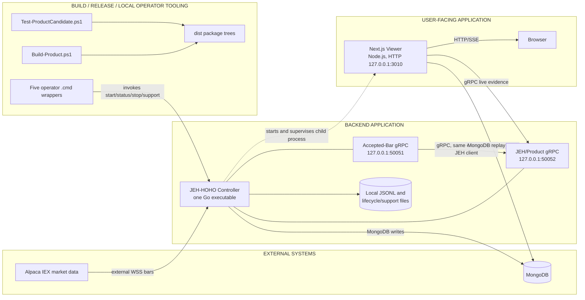

# JEH_HOHO As-Built Repository and Application Inventory

## Date

2026-09-18

## Status

Descriptive, read-only as-built investigation.

## Scope

Current contents of the `JEH_HOHO` repository, including source, generated code, tests, packaging, and checked-in distribution output. This document does not define a future architecture, deployment design, test-readiness decision, or product freeze.

## Executive Summary

The repository contains **two independently runnable applications**:

1. **JEH-HOHO Controller**, one Go executable built from `cmd/jeh-hoho`. It is the single backend process. It owns the Alpaca connection, accepted-Bar source engine, two loopback gRPC servers, the embedded JEH processing runtime, MongoDB evidence writes, local JSONL source persistence, lifecycle control, and supervision of the Viewer child process.
2. **JEH-HOHO Capital Reservoir Viewer**, one Next.js/Node.js application in `viewer`. It serves the browser UI and server-side API routes. Its server side is a gRPC client of the Go application for live evidence and a direct MongoDB client for replay data. It sends live events to the browser with HTTP Server-Sent Events (SSE).

There is one Go `package main` and one `package.json` in the repository. No other independently runnable Go or Next.js application was found. The source gRPC listener on port `50051` and the JEH/product listener on port `50052` are both created inside the same Go executable; they are not separate deployable applications.

`config/`, `packaging/`, and `dist/` implement the current Slice 7 local Windows product wrapper. The package includes the Go executable, a standalone Next.js build, `node.exe`, configuration templates, operator `.cmd` wrappers, contracts, documentation, and a checksum manifest. The two checked-in distribution trees, `dist/JEH-HOHO` and `dist/JEH-HOHO-repeat`, are identical by relative path, size, and SHA-256 at the time of this investigation.

## Repository Inventory

| Path | Primary technology | Current purpose | Classification | Required after production build? | Consumer |
|---|---|---|---|---|---|
| `api/` | Protocol Buffers | Authoritative JEH-HOHO V1 product contract in `api/proto/jeh_hoho/v1/JEH_HOHO.proto` | Application contract source; configuration for generated interfaces | No for current execution; the contract is compiled/generated at build time and a copy is distributed for reference | Go generated source and Viewer generated source |
| `cmd/` | Go | Contains the sole Go entry point, `cmd/jeh-hoho/main.go` | Application source | Source is not required after compilation | `jeh-hoho.exe` |
| `config/` | JSON | Product settings and an Alpaca credential template | Configuration | Yes: packaged `config/product.json` and operator-created `config/credentials.json` are read at Go startup | JEH-HOHO Controller; selected values are passed to Viewer as environment variables |
| `dist/` | Compiled binary, standalone JavaScript, Node.js, batch, JSON/YAML/proto/docs | Checked-in distribution output produced by Slice 7 packaging | Distribution output | A selected package tree is sufficient runtime material, with its external dependencies | Operator runs the packaged Go application, which starts the packaged Viewer |
| `docs/` | Markdown | Design, implementation, investigation, and operator documentation | Documentation | No, except the packaged user guide is useful to the operator rather than executable | Humans; packaging copies the operator guide |
| `gen/` | Generated Go | Go protobuf messages and gRPC stubs generated from the product proto | Generated source | No as separate files after Go compilation | Go application build |
| `internal/` | Go | Controller, source, JEH processing, evidence, lifecycle, persistence adapters, and tests | Application source; shared/runtime libraries; test source; some generated internal JEH source | Source files are not required after compilation; their behavior is embedded in `jeh-hoho.exe` | JEH-HOHO Controller only |
| `packaging/` | PowerShell and Windows batch | Deterministic build/validation and operator command wrappers | Build tooling; test tooling; packaging/release tooling; local Windows orchestration | Build scripts are not required at runtime. The copied `.cmd` wrappers are optional operator-facing runtime controls around the packaged executable | Builders/testers and Windows operators |
| `viewer/` | Next.js, React, TypeScript, Node.js | The sole web application, including UI, server routes, generated TypeScript contract, tests, and standalone packaging helper | Application source; generated source; test source; build configuration | Source is not required after build. The standalone output, static assets, Node runtime, and runtime environment are required | Viewer Node.js process and browser |
| `go.mod` | Go modules | Declares module `jeh-hoho`, Go `1.25.3`, and direct/indirect dependencies | Build configuration | No after creation of a self-contained Go executable | Go toolchain |
| `go.sum` | Go modules | Locks checksums for module dependencies | Build configuration | No after compilation | Go toolchain |
| `buf.yaml` | Buf YAML | Defines the single proto module rooted at `api/proto` and its lint/breaking policy | Contract/build configuration | No for application execution; a copy is included in the distribution as contract metadata | Buf CLI |
| `buf.gen.yaml` | Buf YAML | Defines one generation operation for Go protobuf/gRPC and TypeScript grpc-js output | Code-generation configuration | No for application execution; a copy is included in the distribution as contract metadata | Buf CLI and pinned plugins |

### Internal Source Is Not a Set of Applications

The directories under `internal/` are packages linked into the one Go executable:

- `internal/controller`: composition root, preflight, ownership-safe start/status/stop, Viewer child-process supervision, and support reports.
- `internal/source`: Alpaca ingestion, sequencing, accepted-Bar gRPC service, and local JSONL persistence.
- `internal/jeh`: embedded JEH application/runtime, processing services, execution and Capital logic, source adapters, MongoDB writers, and internal generated DSE_JEH Go contract code.
- `internal/evidence`: product evidence mapping and gRPC gateway.
- `internal/lifecycle`: aggregate status store and product operations service.

None has its own `package main`; none produces a separate executable in the current repository.

## Application Inventory

### 1. JEH-HOHO Controller

| Attribute | As-built value |
|---|---|
| Application name | JEH-HOHO Controller (`jeh-hoho.exe` in the Windows package) |
| Physical source path | `cmd/jeh-hoho/` plus linked packages under `internal/` and generated Go under `gen/go/` |
| Language | Go |
| Main entry point | `cmd/jeh-hoho/main.go` |
| Development build command | `go build -o jeh-hoho.exe ./cmd/jeh-hoho` |
| Packaging build command | `go build -trimpath -buildvcs=false -ldflags '-s -w' -o <package>/bin/jeh-hoho.exe ./cmd/jeh-hoho` |
| Expected executable | `jeh-hoho.exe` on the current Windows packaging path |
| Purpose | Compose and supervise the complete backend, expose product evidence/status, and own the packaged Viewer process |
| Listening ports | Configured `127.0.0.1:50051` and `127.0.0.1:50052` |
| Protocols | gRPC on both listeners; outbound WSS to Alpaca; MongoDB wire protocol; local filesystem; child-process control |
| Inbound connections | Embedded JEH source client connects to `50051`; Viewer live server route connects to `50052`; other package-local gRPC callers could use registered services |
| Outbound connections | Alpaca market-data WebSocket; MongoDB; its own source gRPC listener through the embedded JEH client; starts local Viewer Node process |
| Runtime configuration | Package-relative `config/product.json`; optional `--home` chooses package home; `start`, `status`, `stop`, and `support` commands |
| Required secrets | `alpaca_key` and `alpaca_secret` from package-relative `config/credentials.json`; Mongo URI may also contain credentials even though the default does not |
| MongoDB usage | Required startup preflight; writes JEH trace and Capital Reservoir evidence |
| Alpaca usage | Sole owner of Alpaca connection, authentication, subscription, decoding, reconnect, and health |
| gRPC role | Server for all registered services; also contains the client that consumes its accepted-Bar service |
| JEH_HOHO dependencies | Starts and supervises the Viewer; no other Go application exists |

#### Commands in the executable

- `start`: loads configuration, performs preflight, starts source and JEH gRPC listeners, starts processing, starts the Viewer, reports lifecycle state, and owns shutdown.
- `status`: reads package-local runtime ownership/status state; it does not call the product gRPC status service.
- `stop`: writes an ownership-token-protected package-local stop request consumed by the running controller.
- `support`: writes a sanitized JSON support report under the package `support/` directory.

#### Backend components inside the one process

The Controller opens the accepted-Bar gRPC server on `source_address`, then constructs the embedded JEH application with a gRPC client pointed at that address. The JEH application separately opens `jeh_address` and registers runtime and product services. These are internal component boundaries inside one executable, not evidence of multiple Go applications.

The source engine also writes accepted observations to package-local JSONL files below `source_data_directory`, grouped by collection run and partition. This local persistence is separate from MongoDB evidence persistence.

### 2. JEH-HOHO Capital Reservoir Viewer

| Attribute | As-built value |
|---|---|
| Application name | `jeh-hoho-capital-reservoir-viewer` |
| Physical source path | `viewer/` |
| Framework | Next.js `16.3.5`, React `19.2.8`, TypeScript; Node.js runtime |
| Entry/start mechanism | Development: Next CLI. Packaged: controller executes packaged `node.exe server.js` from the standalone Viewer directory |
| Build command | `npm run build`; `postbuild` copies `.next/static` and optional `public` into `.next/standalone` |
| Start command | Source-tree convention: `npm start` (`next start`). Packaged convention: `node server.js` |
| Listening port | Next.js default is `3000` when started conventionally without `PORT`; product configuration sets `127.0.0.1:3010` and the controller passes `PORT=3010` and `HOSTNAME=127.0.0.1` |
| Server-side responsibilities | Serve Next.js UI/assets; open ProductEvidenceService gRPC stream; convert live gRPC evidence to SSE; query MongoDB for run lists and replay events |
| Browser-side responsibilities | Render the Capital Reservoir UI; call Viewer HTTP API routes; consume `/api/live` with `EventSource` |
| gRPC client usage | Generated static TypeScript grpc-js client calls `ProductEvidenceService.SubscribeEvidence` at `JEH_HOHO_SERVER_ADDRESS` (default `127.0.0.1:50052`) |
| SSE usage | `/api/live` returns `text/event-stream`; server emits `ready`, `reservoir`, and `fault` events to browser clients |
| MongoDB access | Direct server-side read access to the configured Capital Reservoir collection for replay; no Viewer writes found |
| Runtime configuration | `HOSTNAME`, `PORT`, `JEH_HOHO_SERVER_ADDRESS`, `JEH_HOHO_PRODUCT_RUN_ID` (optional), `JEH_HOHO_MONGO_URI`, `JEH_HOHO_MONGO_DB`, and `JEH_HOHO_MONGO_COLLECTION` |
| Required secrets | No Alpaca credentials. A secret is required only if the selected MongoDB URI/authentication requires one |
| Dependency on Go application | Live mode requires ProductEvidenceService on the Go application's `50052` listener; the controller currently owns Viewer startup |

`viewer/` is the only `package.json` and the only Next.js application found in the repository.

## Application Communication

| Source application | Destination | Protocol / port | Purpose | Boundary |
|---|---|---|---|---|
| JEH-HOHO Controller | Alpaca market-data service | External secure WebSocket (`wss://stream.data.alpaca.markets/v2/iex`) | Authenticate, subscribe to configured symbols, and receive bar/updated-bar observations | External |
| JEH-HOHO Controller source component | Same executable's embedded JEH source client | gRPC on `127.0.0.1:50051` | Stream accepted Bars through `AcceptedBarSourceService` | Internal, in one Go process despite the TCP loopback boundary |
| Viewer server | JEH-HOHO Controller | gRPC on `127.0.0.1:50052` | Subscribe to live product/Capital evidence | Internal between applications |
| JEH-HOHO Controller | MongoDB | MongoDB protocol, default `127.0.0.1:27017` | Write trace and Capital Reservoir evidence | External runtime dependency |
| Viewer server | MongoDB | MongoDB protocol, default `127.0.0.1:27017` | Read run metadata and ordered Capital Reservoir events for replay | External runtime dependency |
| Browser | Viewer | HTTP, configured `127.0.0.1:3010` | Load UI and request replay APIs | User-facing application boundary |
| Viewer | Browser | HTTP SSE on `/api/live`, same Viewer port | Deliver live reservoir events and stream faults | User-facing application boundary |
| JEH-HOHO Controller | Local filesystem | File I/O | JSONL accepted-source persistence, runtime ownership/status, stop request, and support output | Internal/local runtime dependency |

No browser-to-gRPC connection exists. The Viewer Node server is the gRPC client and SSE bridge.

## Proto/gRPC Ownership

### Contract and generated locations

- Authoritative product proto: `api/proto/jeh_hoho/v1/JEH_HOHO.proto`.
- Generated product Go: `gen/go/jeh_hoho/v1/JEH_HOHO.pb.go` and `JEH_HOHO_grpc.pb.go`.
- Generated product TypeScript: `viewer/src/generated/jeh_hoho/v1/JEH_HOHO.ts`.
- Additional generated internal DSE_JEH Go code exists under `internal/jeh/gen/dse_jeh/`. Its originating `.proto` is not present in this repository, so the current repository contains generated internal code but not its authoritative source contract.
- `buf generate` is build-time code generation. The Viewer imports generated TypeScript directly and does **not** load a `.proto` dynamically at runtime. The Go binary also uses compiled generated code.

### Product service ownership

| Service | Server application | Client application/component | Purpose |
|---|---|---|---|
| `AcceptedBarSourceService` | JEH-HOHO Controller, listener `50051` | Embedded JEH product source client inside the same Go executable | Stream accepted Alpaca observations into JEH processing |
| `ProductEvidenceService` | JEH-HOHO Controller, listener `50052` | Viewer Node server | Stream product evidence, including Capital Reservoir events, for the live UI |
| `ProductOperationsService` | JEH-HOHO Controller, listener `50052` | No production application client was found; the controller's CLI status path uses package-local state instead | Return a read-only aggregate product status snapshot |

The Go application also registers generated internal DSE_JEH `RuntimeOperationsService` and `RuntimeEvidenceService` on `50052`. These are embedded runtime surfaces, not separate applications, and no separate production client application for them was found in this repository.

## MongoDB Ownership

MongoDB is an external dependency, not a JEH_HOHO application. Both runnable applications connect directly to it.

| Application | Configuration | Collection | Responsibility |
|---|---|---|---|
| JEH-HOHO Controller | `mongo_uri`, `mongo_database`, `mongo_trace_collection` in `product.json` | Default `h_h_stage_emit_values` | Write JEH execution trace records. `NewProduct` opens the writer when the controller does not inject one |
| JEH-HOHO Controller | `mongo_uri`, `mongo_database`, `mongo_reservoir_collection` in `product.json` | Default `capital_reservoir_events` | Write Capital Reservoir ledger events. The writer is required by the online product composition |
| Viewer Node server | Environment derived by the controller from the same product settings | Default `capital_reservoir_events` | Read only: aggregate available runs and load one run ordered by `event_sequence` for replay |

Startup preflight opens and closes both Go MongoDB writers to prove availability. The normal online composition then opens owned writers for runtime use. The Viewer creates its own MongoDB client; it does not receive replay data through the Go gRPC service.

`internal/jeh/adapter/mongo/repository.go` also supports the default `bar_sequence` collection for the embedded JEH offline source path. The current product controller hard-codes its composed JEH mode to ONLINE and does not expose that offline path as another runnable application. Current online source observations are instead persisted to local JSONL by `internal/source/persistence`.

## Alpaca Ownership

The **JEH-HOHO Controller is the only runnable application that connects to Alpaca**.

- Implementation package: `internal/source/alpaca`, principally `stream.go` and `decode.go`.
- Composition: `internal/controller/preflight.go` validates an authenticated session; `internal/controller/runtime.go` creates the runtime stream.
- Credentials: `alpaca_key` and `alpaca_secret` are loaded only by the Go controller from package-relative `config/credentials.json`, normally created from `config/credentials.example.json` by the Configure command.
- Viewer requirement: none. The controller does not pass Alpaca credentials to the Viewer.
- Current connection: configured Alpaca IEX WebSocket endpoint and feed. The stream code authenticates, subscribes to configured symbols, accepts separate `b` and `u` arrivals, and reconnects without gap fill.

This describes the current local implementation only; it does not prescribe hosted secret delivery.

## Slice 7 Packaging Analysis

### `config/`

`config/product.json` is runtime product configuration copied into the package. `config/credentials.example.json` is a non-secret template; runtime startup requires an operator-created `config/credentials.json`. Configuration is therefore both packaging input and product runtime material.

### `packaging/`

`Build-Product.ps1` is deterministic build/release tooling. It runs Buf generation/lint/build, Go tests/vet, Viewer restore/tests/typecheck/lint/build, compiles the Go executable, assembles runtime assets, creates SHA-256 metadata, verifies it, and invokes package validation.

`Test-ProductCandidate.ps1` is development/release validation tooling. It copies a package to a temporary isolated location, verifies hashes and forbidden references, exercises `status` and `support`, and optionally exercises the full packaged lifecycle. It does not provision MongoDB.

### Operator commands

| Artifact | Implementation | What it does | Classification |
|---|---|---|---|
| `CONFIGURE JEH-HOHO.cmd` | Batch file directly copies the credential template if needed and opens `credentials.json` in Notepad | Local first-use Alpaca credential entry | **B** local Windows orchestration; **E** end-user functionality |
| `START JEH-HOHO.cmd` | Invokes `bin\jeh-hoho.exe start --home <package>` | Starts the Go controller, which starts all backend components and the Viewer | **A** product runtime entry; **B** local Windows orchestration; **E** end-user functionality |
| `STATUS JEH-HOHO.cmd` | Invokes `bin\jeh-hoho.exe status --home <package>` | Reads and displays package-local lifecycle status and Viewer URL | **A** product runtime functionality; **B** local Windows orchestration; **E** end-user functionality |
| `STOP JEH-HOHO.cmd` | Invokes `bin\jeh-hoho.exe stop --home <package>` | Writes a token-matched stop request for the owning controller | **A** product runtime functionality; **B** local Windows orchestration; **E** end-user functionality |
| `CREATE SUPPORT REPORT.cmd` | Invokes `bin\jeh-hoho.exe support --home <package>` | Creates a sanitized package-local JSON support report | **A** product runtime functionality; **B** local Windows orchestration; **E** end-user functionality |
| `Build-Product.ps1` | PowerShell packaging pipeline | Generates, validates, builds, assembles, hashes, and validates distribution output | **C** development/build tooling; **D** packaging/release tooling |
| `Test-ProductCandidate.ps1` | PowerShell isolated-package checker | Validates package integrity and optionally lifecycle behavior | **C** development/test tooling; **D** packaging/release validation |

The `.cmd` files contain no JEH or Capital business logic. They wrap controller functionality for the current local Windows operator experience.

### `dist/`

`dist/JEH-HOHO` and `dist/JEH-HOHO-repeat` are distribution outputs, not additional applications. Each contains:

- `bin/jeh-hoho.exe`;
- `viewer/server.js`, traced server dependencies, and `.next/static` from the standalone Viewer build;
- `runtime/node.exe`;
- product configuration and credential template;
- the five operator `.cmd` wrappers;
- contract/config copies and Viewer dependency lock for traceability;
- packaged user guide;
- `package-manifest.json` with metadata and file hashes.

The two trees were identical by relative paths, lengths, and SHA-256 during this investigation. The repository does not document why the repeated copy is retained.

## Source Versus Deployment Artifacts

### Go

Normal `.go` files under `cmd/`, `internal/`, and `gen/go/` are compilation inputs. Files named `*_test.go` are compiled and run only by `go test`; they are excluded from a normal `go build`. A production build for the sole Go entry point produces one executable containing the linked controller, source, JEH, evidence, lifecycle, generated protobuf, gRPC, MongoDB, and Alpaca client code.

To run the packaged Go executable as currently composed, the following are required:

- the compiled executable;
- readable `config/product.json` and populated `config/credentials.json` under the selected package home;
- the packaged Viewer standalone files and `node.exe`, because controller startup treats them as required and supervises the Viewer;
- writable package locations for source data, runtime ownership/stop files, and support reports;
- reachable Alpaca and MongoDB services;
- available configured loopback ports `50051`, `50052`, and `3010`.

The source tree, Go toolchain, module files, generated `.go` files as loose files, and `*_test.go` files are not required to run the already compiled executable.

### Next.js

`npm run build` produces a standalone server because `next.config.ts` sets `output: "standalone"`. The postbuild script copies static assets and optional public assets into that standalone tree. The current package runs the result with bundled `runtime/node.exe` and `viewer/server.js`.

Runtime requires the standalone server tree, `.next/static`, optional packaged public assets if present, Node.js, host/port settings, the Go gRPC address for live mode, and MongoDB settings for replay. TypeScript/React source, dev dependencies, tests, TypeScript compiler, and the source `package.json` scripts are build-time concerns rather than individually selected production files.

## Deployment Unit Table

| Application | Technology | Source Path | Executable/Runtime | Purpose | Inbound Protocol | Outbound Dependencies | Secrets Required | Persistence | User Facing? | Potential Hosted Service Unit |
|---|---|---|---|---|---|---|---|---|---|---|
| JEH-HOHO Controller | Go | `cmd/jeh-hoho/`, linked `internal/`, `gen/go/` | One compiled Go executable (`jeh-hoho.exe` in current package) | Alpaca ingestion, source sequencing, JEH/Capital processing, evidence/status gRPC, lifecycle, Viewer supervision | gRPC on configured `50051` and `50052`; package-local CLI invocations/files | Alpaca WSS, MongoDB, local filesystem, packaged Viewer child process; internal loopback gRPC | Alpaca key/secret; Mongo credentials if URI requires them | Writes Mongo trace and reservoir collections; writes local source JSONL and control/support files | Indirectly, through Viewer | Go service unit, while noting current code also assumes local child-process and filesystem ownership |
| JEH-HOHO Capital Reservoir Viewer | Next.js/Node.js | `viewer/` | Standalone Next.js `server.js` on Node.js | Browser UI, HTTP APIs, live gRPC-to-SSE bridge, Mongo replay reads | HTTP/SSE on configured `3010` | Go ProductEvidenceService on `50052`; MongoDB | Mongo credentials only if required by URI; no Alpaca secret | Reads Mongo Capital Reservoir collection; no writes found | Yes | Next.js service unit |

The table identifies physical application units only. The current Slice 7 `.cmd` and PowerShell tooling are local orchestration/build artifacts, not a third deployable application.

## As-Built System Diagram

## Human Summary

1. **How many Go executable applications exist?** One.
2. **What is its name?** JEH-HOHO Controller, packaged as `jeh-hoho.exe`.
3. **How many Next.js applications exist?** One.
4. **What is its name?** `jeh-hoho-capital-reservoir-viewer`, described as the JEH-HOHO Capital Reservoir Viewer.
5. **Which application connects to Alpaca?** The Go JEH-HOHO Controller only.
6. **Which application connects to MongoDB?** Both: the Go application writes trace/reservoir evidence; the Viewer server reads reservoir evidence for replay.
7. **Which application exposes gRPC?** The Go application. It owns both loopback listeners and all registered services.
8. **Which application consumes gRPC?** The Viewer consumes ProductEvidenceService for live data. The Go executable also contains the internal client that consumes its own AcceptedBarSourceService.
9. **Which application is currently user-facing?** The Next.js Viewer through HTTP/SSE to the browser.
10. **What does Slice 7 packaging add?** A deterministic build/validation pipeline, a self-contained Windows package with Go and Node runtimes/assets, configuration/templates, five operator wrappers, documentation/contracts, and a hash manifest. It does not add another application or alter JEH/Capital behavior.
11. **What are the actual independent deployment units?** One Go backend application and one Next.js application, plus external MongoDB and Alpaca dependencies. The current local package couples their lifecycle by having the Go process start the Viewer.
12. **Are ambiguities unresolved before Railway or AKS design?** Yes. The physical units are clear, but several current local assumptions and ownership decisions must be addressed before a hosted design can be described accurately.

## Open Questions

These are current as-built deployment ambiguities, not proposed answers:

1. Should a hosted deployment preserve the controller's current ownership of starting/stopping the Viewer, or should the two existing applications be independently supervised by the hosting platform?
2. How should the current loopback-only validation and addresses for ports `50051`, `50052`, and `3010` map to hosted networking? The product contract explicitly describes V1 callers as package-local and does not authorize remote exposure.
3. Does the accepted-Bar `50051` TCP boundary need to remain a network listener when both its server and sole client are inside the same Go executable?
4. What hosted storage, retention, and volume semantics are required for package-local accepted-source JSONL, runtime ownership/stop files, and support reports?
5. Should the Viewer continue to connect directly to MongoDB for replay, including holding any database credential required by the hosted environment, or should that ownership change? The current repository implements direct access.
6. How will the Windows-specific bundled `node.exe`, `.cmd` controls, Notepad configuration flow, browser launch, and package-home assumptions be represented or omitted in a non-Windows hosted runtime?
7. What authentication, encryption, and exposure policy is required if current plaintext loopback gRPC or local HTTP boundaries cease to be host-local?
8. What is the intended role of the checked-in duplicate `dist/JEH-HOHO-repeat` tree?
9. The authoritative source `.proto` for generated internal DSE_JEH code under `internal/jeh/gen/dse_jeh/` is absent from this repository. Is that generated code intentionally the only carried artifact for the embedded runtime?
10. Hosted health, restart, scaling, graceful shutdown, secret injection, MongoDB provisioning, and persistence requirements are not defined by the current repository inventory and must be decided before Railway or AKS deployment design.
